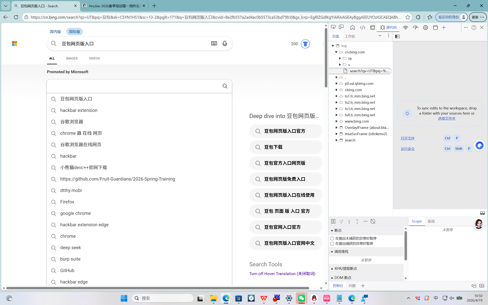
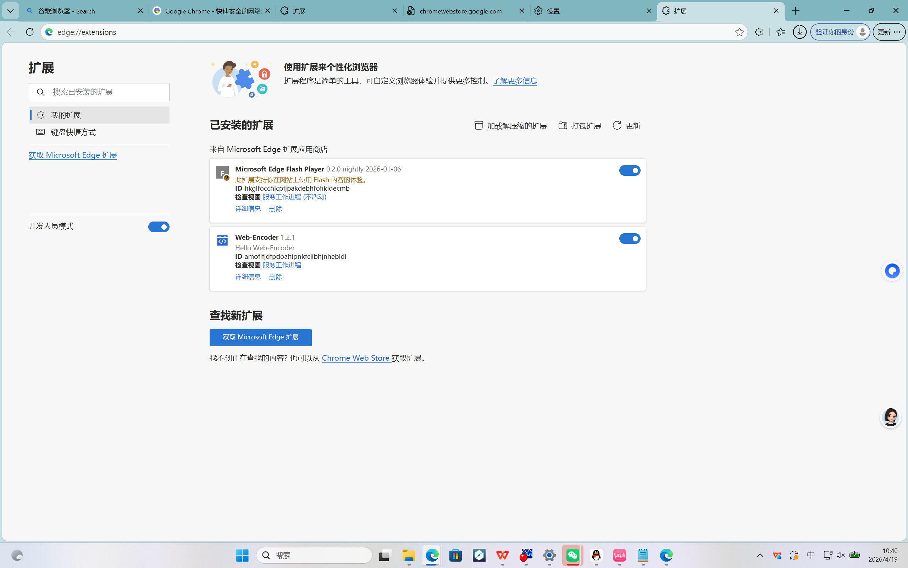
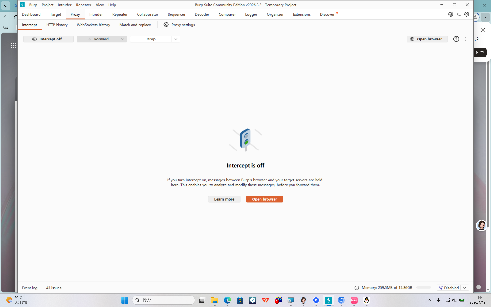
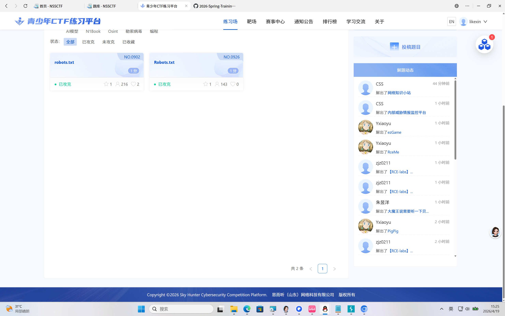

# Web 入门作业 - 李可欣

- 年级：25级

- 方向：Web

## 一、工具安装

### 1. 浏览器开发者工具（F12）

- 安装情况：Chrome/Edge 浏览器自带，无需额外安装

- 功能说明：用于查看网页源代码、调试前端代码，是 Web 方向最基础的工具

- 使用截图：

### 2. Web-Encoder（编码解码工具，替代 Hackbar）

- 安装情况：已安装并启用

- 功能说明：用于 URL 编码、Base64 编码等操作，可替代 Hackbar 完成简单的请求编辑

- 安装截图：

### 3. Burp Suite Community Edition（抓包工具）

- 安装情况：已成功安装并启动

- 功能说明：用于 Web 应用的抓包、修改请求、分析响应，是 Web 安全测试的核心工具

- 安装截图：

## 二、题目 Writeup

### 题目1：\[SWPUCTF 2021 新生赛]gift\_F12

- 题目要求：flag 以 NSSCTF{} 形式提交

- 解题思路：

&#x20; 1. 页面屏蔽右键/F12，使用 `view-source:` 强制查看源码或通过 Burp Suite 的 HTTP history 定位响应内容。

&#x20; 2. 在源码/Burp响应中搜索 `flag`，找到原始 flag 字符串。

- 原始 flag（来自源码）：WLLMCTF{WelcOme\_t0\_WLLMCTF\_Th1s\_1s\_th3\_G1ft}

- 提交格式处理：NSS 平台要求统一使用 NSSCTF{} 前缀，因此将前缀替换为 NSSCTF。

- 最终提交 Flag：\*\*NSSCTF{WelcOme\_t0\_WLLMCTF\_Th1s\_1s\_th3\_G1ft}\*\*

- 关键截图（源码来源）：

### 题目2：NSSCTF 练习场 Robots.txt

- 题目要求：按题目提示获取 flag 并提交

- 解题思路：

&#x20; 1. 访问站点小写 `robots.txt` 文件，查看被 Disallow 限制的隐藏路径。

&#x20; 2. 根据路径依次访问对应页面，查找关键信息。

&#x20; 3. 在页面中找到 flag 并完成提交。

- 最终提交 Flag：\*\*已提交成功\*\*

- 关键截图： 

### 题目3：\[MoeCTF 2021]Web 安全入门指北—GET

- 做题方法：查看题目给出的PHP代码，找到参数名和需要传入的值，再用GET传参获取flag。

- 解题思路：

&#x20; 1. 看代码 `$moe = $\_GET\['moe']`，得出需要传的参数名是 \*\*moe\*\*。

&#x20; 2. 看代码 `if ($moe == "flag")`，得出需要传的值是 \*\*flag\*\*。

&#x20; 3. 在网址后拼接 `?moe=flag` 访问，即可拿到flag。

- 最终提交 Flag：已提交成功

- 关键截图：

