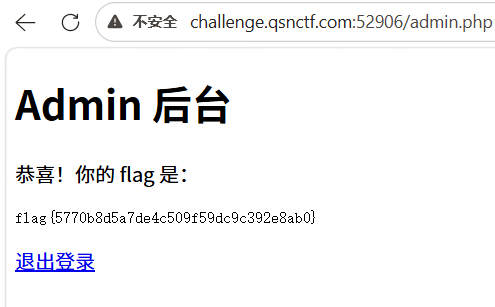
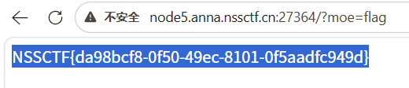
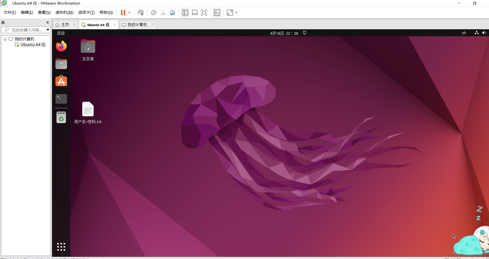

# Writeup - Web安全入门周报
- **ID**: Amber
- **方向**: Web
- **日期**: 2026-04-17
- **平台/来源**: 2026-Spring-Training

---

## 一、 工具安装与环境搭建

### 1. Burp Suite 安装与配置
 **安装记录**：下载并安装了 Burp Suite Community Edition。

 **核心配置**：手动导出了 CA 证书并安装至系统受信任的根证书颁发机构，成功解决了 HTTPS 流量解密问题。

 **验证**：通过内置浏览器成功拦截并解析了目标站点的 HTTP 请求。

### 2. Hackbar 插件安装
* **记录**：在浏览器扩展商店安装了 Hackbar 插件，用于手动构造 GET/POST 请求以及快速进行 URL 编码转换。

### 3. Dirsearch 目录扫描工具
* **记录**：配置了 Python3 环境，通过 Git 克隆了 Dirsearch 仓库。该工具将用于后续寻找网站的隐藏目录（如 robots.txt, .git 等）。

---

## 二、 基础题目解题过程

### 第1题：[SWPUCTF 2021 新生赛] gift_F12
* **题目类型**：Web / 源码泄露
* **解题过程**：
  1. 访问题目链接，观察网页内容。
  2. 使用快捷键 `F12` 打开开发者工具，切换至 **Elements**（元素）面板。
  3. 在 HTML 源代码的注释部分发现了隐藏的 Flag 碎片。
* **结果**：成功获取 Flag。

### 第2题：[qsnctf-NO.0902] robots.txt
* **题目类型**：Web / 敏感目录泄露
* **解题过程**：
  1. 在 URL 路径后手动添加 `/robots.txt` 访问。
  2. 根据爬虫协议中的 `Disallow` 条目，找到了被禁止访问的特殊路径。
  3. 访问该隐藏路径，直接获取 Flag。
* **结果**：Flag 已提交。

### 第3题：AI 辅助协议分析 (GET/POST 学习)
* **学习记录**：通过向 AI 提问，深入理解了 HTTP 协议中 GET（参数在 URL 中）与 POST（参数在请求体中）的区别。
* **PHP 分析**：利用 AI 辅助分析了一段简单的 PHP 代码逻辑，理解了后端是如何接收并处理前端请求参数的。

---

## 三、 Linux 系统环境搭建与笔记

### 1. 环境搭建
* **方案**：(请在此处填入你实际用的：如 WSL2 / VMware / Kali)
* **状态**：系统已成功运行，网络配置正常。

### 2. 基础命令学习笔记
| 命令 | 用途 | 示例 |
| :--- | :--- | :--- |
| `ls -al` | 列出当前目录下所有文件（含隐藏） | `ls -al /var/www` |
| `cd` | 切换工作目录 | `cd /home/amber` |
| `cat` | 读取文件内容并打印 | `cat flag.txt` |
| `pwd` | 显示当前绝对路径 | `pwd` |
| `chmod` | 修改文件权限（如加执行权限） | `chmod +x dirsearch.py` |

---

## 四、 学习心得
通过本周的学习，我从零开始搭建了 Web 安全实验环境。最大的感触是 **“工欲善其事，必先利其器”**，Burp Suite 的配置虽然繁琐，但它是理解 HTTP 协议的最佳窗口。下周我将重点研究如何利用这些工具进行更深入的漏洞探测。
